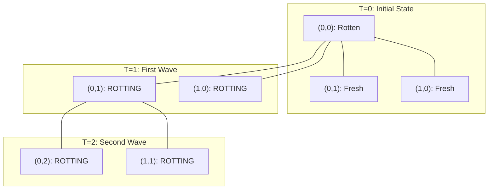
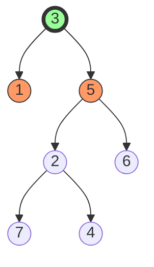
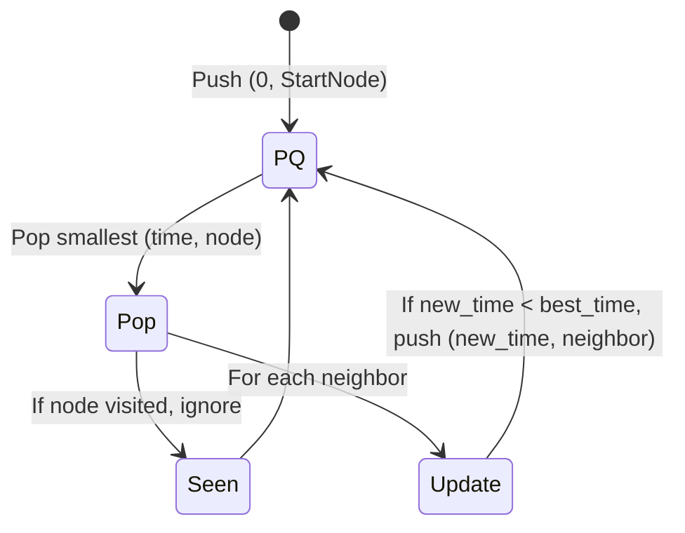

# Quick Guide: Matrix, Graph, and Trees

This guide provides a quick overview of essential algorithms and data structures, focusing on **why** specific approaches are chosen and how they handle different problem constraints.

This guide focuses on **Matrix BFS/DFS**, **Binary Trees**, and **Graphs**, using your current codebase as a foundation.

---

## 1. Matrix BFS & DFS (Grid-Based Problems)

In grid problems, the decision between BFS and DFS usually comes down to whether you are looking for **connectivity** or the **shortest path**.

### **Decision Tree: BFS vs. DFS in Matrices**
- **Use BFS when:** You need the **shortest path** in an unweighted grid. BFS explores layer-by-layer, ensuring that the first time you reach a target, it's via the shortest route.
    - *Example:* [1091_shortest_path_binary_matrix.py](leet_code/graph/1091_shortest_path_binary_matrix.py)
    - *Real-world Usage:* Finding the quickest route through city blocks modeled as a grid.
- **Use Multi-Source BFS when:** There are multiple starting points and you need to find the "spread" time or distance to all other points simultaneously.
    - *Example:* [994_rotting_oranges.py](leet_code/graph/994_rotting_oranges.py)
    - *Real-world Usage:* Identifying the closest available resources from multiple source locations.
- **Use DFS when:** You need to explore **connectivity**, count "islands," or solve exhaustive path problems where memory (stack vs. queue) is a consideration.
    - *Example:* [200_number_island.py](leet_code/graph/200_number_island.py)
    - *Real-world Usage:* Identifying "reachable regions" or contiguous zones in a spatial dataset.

### **Pro-Tip: Space Complexity**
- DFS uses stack space (recursion depth), which can be $O(\text{stack depth})$.
- BFS uses a queue, which can be $O(\text{perimeter of search})$ or $O(M \times N)$ in the worst case.

### **Pattern Deep Dive: Multi-Source BFS (Rotting Oranges)**
This pattern is used when you have multiple "sources" of an effect spreading across a grid.

**Example Scenario:**
```text
Grid at T=0 (2=Rotten, 1=Fresh, 0=Empty)
[2, 1, 1]
[1, 1, 0]
[0, 1, 1]
Steps:
1. Minute 1: Oranges at (0,1) and (1,0) rot.
2. Minute 2: Oranges at (0,2), (1,1) rot.
3. ... until all are rotten or unreachable.
```

**Step-by-Step Visualization:**


**Algorithm Steps:**
1.  **Initialize:** Create a `queue` and add all [(r, c)](leet_code/trees/236_lowest_common_ancester.py#39-51) coordinates of initially rotten oranges. Count total [fresh_oranges](leet_code/graph/994_rotting_oranges.py#121-129).
2.  **Level-by-Level Processing:** While the queue is not empty and `fresh_oranges > 0`:
    *   Set `size = len(queue)`. Increment `minutes`.
    *   Loop `size` times:
        *   Pop an orange. Check its 4 neighbors.
        *   If a neighbor is **Fresh**:
            *   Mark it **Rotten**.
            *   Decrement [fresh_oranges](leet_code/graph/994_rotting_oranges.py#121-129).
            *   Add neighbor to the `queue`.
3.  **Conclusion:** If `fresh_oranges == 0`, return `minutes`, otherwise return `-1`.

---

## 2. Binary Trees

Trees are commonly used to model hierarchies or spatial data.

### **Key Patterns & Decisions**
- **Post-Order Traversal (Bottom-Up):** Essential when a node's result depends on its children.
    - *Example:* [236_lowest_common_ancester.py](leet_code/trees/236_lowest_common_ancester.py)
    - *Logic:* We check left and right subtrees. If both return values, the current node is the LCA. This "bubbles up" the answer.
- **Level-Order Traversal (BFS):** Used when the horizontal relationship between nodes matters.
    - *Example:* [102_binary_tree_level_order.py](leet_code/trees/102_binary_tree_level_order.py)
- **Serialization:** Converting trees to strings for storage or transmission.
    - *Example:* [297_serialize_deserialize_binary_tree.py](leet_code/trees/297_serialize_deserialize_binary_tree.py)
    - *Real-world Usage:* Transferring complex tree structures (like Quadtrees) over APIs or between services.

### **Spatial Indexing (Quadtrees)**
**Quadtrees** are used to index spatial data efficiently. A Quadtree is a tree where each internal node has exactly four children, used to partition a two-dimensional space into quadrants.
- *Conceptual Flow:* If a 2D "bucket" (matrix section) contains too many data points, split it into 4 quadrants (tree nodes). This provides an efficient bridge between grid-based and hierarchical logic.

### **Pattern Deep Dive: Post-Order DFS (Lowest Common Ancestor)**
Post-order traversal is the "Bottom-Up" approach. You ask your children for information and then make a decision at the parent level.

**Example Scenario:**
Find LCA of nodes **5** and **1** in a tree where **3** is the root.
1.  Search 5 and 1 in the left subtree.
2.  Search 5 and 1 in the right subtree.
3.  If both subtrees return something, the current node is the "meeting point" (LCA).

**Visualization:**


**Algorithm Steps:**
1.  **Base Case:** If the current node is `Null`, or matches `p` or `q`, return the current node.
2.  **Recurse:**
    *   `left = self.lowestCommonAncestor(root.left, p, q)`
    *   `right = self.lowestCommonAncestor(root.right, p, q)`
3.  **Decision Policy:**
    *   **Both subtrees found a node?** This means `p` and `q` are split under me. I am the LCA. Return `self`.
    *   **Only one subtree found a node?** Both `p` and `q` are in that specific subtree. Return the result from that subtree.
    *   **Neither?** Return `None`.

---

## 3. Graphs

Graph theory is fundamental for modeling networks, dependencies, and complex relationships.

### **Why Specific Algorithms?**
- **Dijkstra’s Algorithm:** Standard for shortest paths in **weighted** graphs (where edges are time/distance).
    - *Example:* [743_network_delay_time.py](leet_code/graph/743_network_delay_time.py) or [dijkstra_leet.py](leet_code/graph/dijkstra_leet.py).
    - *Real-world Usage:* Routing based on real-time traffic or network latency (weights = delay).
- **Topological Sort (Kahn's or DFS):** Used for dependency resolution.
    - *Example:* [207_course_schedule.py](leet_code/graph/207_course_schedule.py)
    - *Real-world Usage:* Determining the order of operations with constraints (e.g., task scheduling, build systems).
- **Union-Find (Disjoint Set Union):** Dynamic connectivity.
    - *Example:* [1584_min_cost_to_connect_all_points.py](leet_code/graph/1584_min_cost_to_connect_all_points.py)
    - *Real-world Usage:* Identifying if two network zones remain connected after a link failure.

### **Pattern Deep Dive: Dijkstra's Algorithm (Shortest Path/Time)**
A fundamental algorithm for finding the "cheapest" path when edges have non-negative weights.

**Example Scenario:**
Calculate time for a signal from Node `K` to reach all nodes.
- Edges: [(source, target, weight)](leet_code/trees/236_lowest_common_ancester.py#39-51)
- `weights` = travel time.

**Visualization (Priority Queue Flow):**


**Algorithm Steps:**
1.  **Graph Setup:** Convert edge list to an adjacency list: `graph[u] = [(v, w), ...]`.
2.  **State Management:**
    *   `min_heap = [(0, K)]` (Initial time 0 at starting node K).
    *   `distances = {node: infinity}`. Set `distances[K] = 0`.
3.  **The Greedy Loop:** While `min_heap` exists:
    *   Pop the entry with the smallest `time`.
    *   If `time > distances[node]`, skip (we already found a faster way).
    *   For each neighbor:
        *   Calculate `new_time = time + weight`.
        *   If `new_time < distances[neighbor]`:
            *   Update `distances[neighbor] = new_time`.
            *   Push [(new_time, neighbor)](leet_code/trees/236_lowest_common_ancester.py#39-51) to heap.
4.  **Final Check:** The result is `max(distances.values())`. If any node is still at `infinity`, return `-1`.

---

## 4. Suggested Exercises (Not in Codebase)

To round out your understanding, I recommend implementing these high-frequency algorithm problems:

| Topic | LeetCode # | Problem Name | Why study this? |
| :--- | :--- | :--- | :--- |
| **Matrix** | 54 | **Spiral Matrix** | Tests array manipulation and boundary condition logic. |
| **Matrix** | 74 | **Search a 2D Matrix** | Combining binary search with matrix indexing (very common). |
| **Graph** | 815 | **Bus Routes** (Hard) | Practical network problem. BFS on a graph of "routes" rather than "stations." |
| **Graph** | 399 | **Evaluate Division** | Modeling equations as directed weighted graphs. |
| **Trees** | 427 | **Construct Quad Tree** | Direct application of spatial indexing and recursive subdivision. |
| **Trees** | 230 | **Kth Smallest in BST** | Fundamental BST property verification. |
| **Graphs** | 305 | **Number of Islands II** | Dynamic Union-Find; adding nodes and checking connectivity in real-time. |

---

## Final Implementation Strategies

1.  **Clarify Constraints:** Always identify the input size ($V, E$), whether weights are non-negative, and if the graph is sparse or dense to choose the optimal data structure.
2.  **Analyze Trade-offs:** Consider memory usage (Iterative vs. Recursive DFS) and time complexity (Queue-based BFS vs. Heap-based Dijkstra).
3.  **Real-world Mapping:** Model problems by mapping entities to nodes and relationships to edges to leverage established algorithms effectively.
